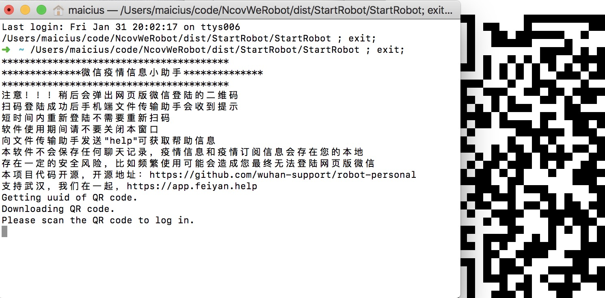
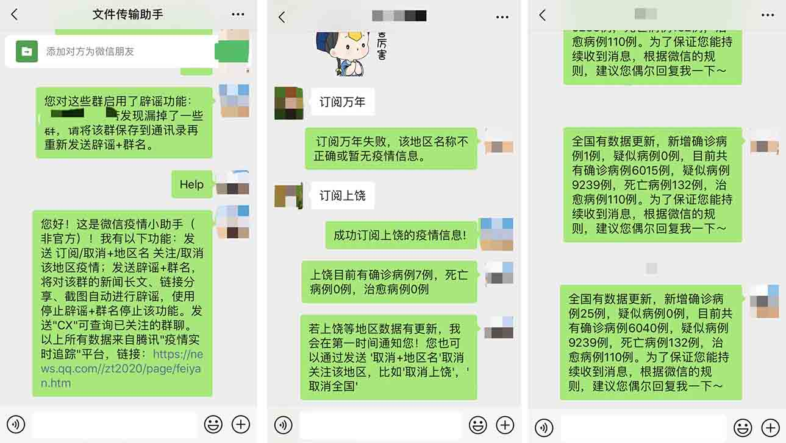
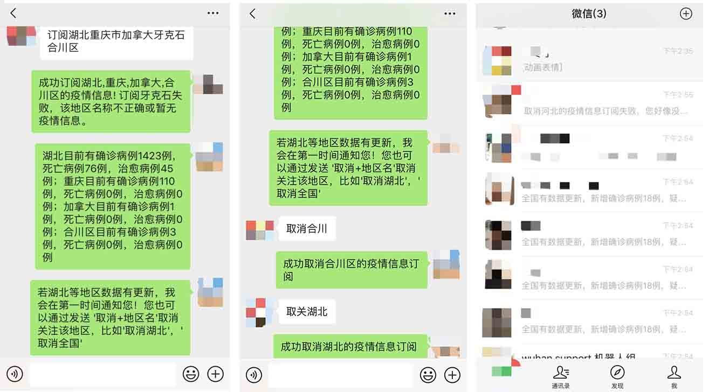
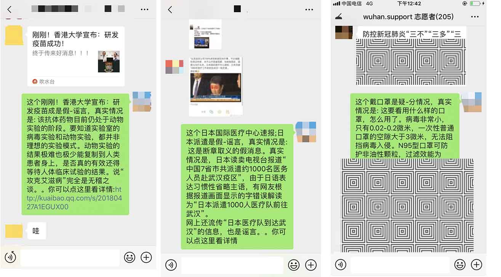

# 微信疫情信息小助手（非官方）使用指南

开发者请查看开发者手册（待完善中）[开发者手册](./developer.md)

### 简介

基于itchat，使用个人微信账户，利用爬虫信息从网络上搜集实时疫情数据，用户通过微信消息进行订阅，若出现相关信息，则主动对用户进行推送。可根据用户指令监控群聊，对群内出现的新闻、分享、图片自动进行辟谣。

> 图1 登陆成功之后的提醒

github:[robot-personal](https://github.com/wuhan-support/robot-personal)


### 数据来源

腾讯实时疫情追踪平台，[https://news.qq.com/zt2020/page/feiyan.htm](https://news.qq.com/zt2020/page/feiyan.htm)）

腾讯辟谣平台，URL：[https://news.qq.com/zt2020/page/feiyan.htm#rumor](https://news.qq.com/zt2020/page/feiyan.htm#rumor)

- 接收群用户@并返回查询结果

### 使用方式

#### 0.下载软件

- 软件下载：

	国内用户：[百度云](https://pan.baidu.com/s/1ZcZrBIqflHpmr2MkHLNYyA)
	
	国外用户：[谷歌Storage](https://drive.google.com/open?id=1UvB-ICQNvlCHeqBOZ1Qp4fNZisRt5L2d)


#### 1.登陆

在软件根目录下双击StartRobot.exe（Mac上为StartRobot）开始运行，


会弹出一个二维码，该二维码是微信网页版登陆的二维码

如果您的微信扫码后提示“为了您的安全，无法登陆微信网页版”等字样，则您无法使用本软件。

扫码登陆成功后，文件传输助手会收到登陆成功的消息（如图2）。

向文件传入助手发送Help/帮助可以获得帮助信息（如图3-左）

#### 2.订阅指定地区疫情

登陆之后就可以接收好友的订阅，当好友发送订阅+地区名时，比如订阅湖北，会返回订阅成功会失败的消息，并推送当前该地区疫情信息


> 图3: （左）发送帮助/Help可获取帮助信息； （中）订阅地区信息成功和失败； （右）自动推送数据

好友可选择取消订阅，其中“取消全部”会取消所有订阅，部分运行情况如图。



> 图4: （左）同时订阅多个地区的信息； （中）取消订阅信息； （右）自动推送数据效果图

#### 3.指定群聊的谣言检测

对文件传输助手发送“辟谣+群名”，比如“辟谣家族群”，就可以开始对家族群的谣言检测。为了保证能正确定位到群聊，请避免群名称重复，并将群聊保存到通讯录。



>图5: (左)对分享的新闻的谣言检测； (中) 对图片新闻中的谣言检测； （右）对长段文字的谣言检测

你可以发送CX查询已经启用了谣言检测的群聊


>图5：（左）开启辟谣 （中）停止辟谣 （右）实时查询

#### 4.群聊里查询实时数据

群聊普通用户发送：@机器人查城市，比如@机器人查北京，则返回北京的疫情信息，如图5（右）。

### 使用注意

1.本项目本质上是模拟网页版微信的操作，所以使用前请确保您的账号能登陆网页版微信。

2.给同一人发送的类似的信息过多时，新发送的信息会无法送达，必须要该用户主动响应一下才行。这是好像是微信的限制，很难解决。

3.本项目频繁使用之后可能会造成您无法无法登陆网页版微信。

4.账号重新登陆之后之前的订阅会失效（短时间内重新热登陆不会），会在以后的版本中解决该问题

### 错误提示

1.若在Mac系统上双击StartRobot无反应，很可能是系统没有识别它是可执行文件，按如下方式解决:

打开命令行窗口，输入

```
cd {软件根目录}
chmod +x StartRobot
```

2.有关登陆的问题，程序默认是热重启，即短时间内重新登陆不需要重新扫码，打开即可登陆，若想切换账号，手动删除itchat.pkl文件，再重新打开软件登陆。

3.程序显示 return code 1102 并Log Out，这是由于微信的检测机制发现了异常导致的强行下线，通常情况下可以直接重新登陆，如果无法重新登陆，很有可能就是被封号了（不会影响手机微信的使用，只会影响网页版微信）。
