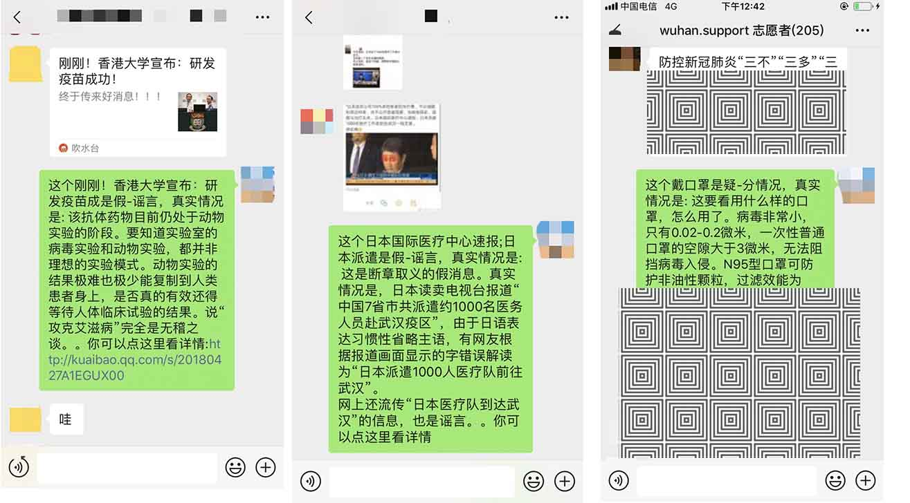

# 微信疫情信息小助手（非官方）

### 简介

基于itchat，使用个人微信账户，利用爬虫信息从网络上搜集实时疫情数据，用户通过微信消息进行订阅，若出现相关信息，则主动对用户进行推送。可根据用户指令监控群聊，对群内出现的新闻、分享、图片自动进行辟谣。


> 图1 登陆成功之后的提醒

## 功能列表

### 1.爬虫模块

- 1.定时从腾讯新闻获取全国疫情数据（地址:[https://news.qq.com/zt2020/page/feiyan.htm](https://news.qq.com/zt2020/page/feiyan.htm)）
- 2.按城市/省份对数据进行存储并对比数据是否更新
- 3.推送更新的数据到微信机器人
- 4.根据用户设定的地区推送实时数据

### 2.微信实时疫情推送模块

- 1.接收用户订阅，包括省份/城市/关键词
- 2.接收更新的数据并转发给订阅的用户
- 3.取消订阅

### 3.群聊辟谣机器人

针对指定的微信群（主要是针对家族群这种年龄跨度较大的群），检测聊天记录中的新闻(长段文字)、分享（标题）、图片，将该信息拿到腾讯辟谣平台上进行搜索，若为谣言或存疑，则返回辟谣链接。

#### 数据来源

腾讯辟谣平台，URL：[https://news.qq.com/zt2020/page/feiyan.htm#rumor](https://news.qq.com/zt2020/page/feiyan.htm#rumor)

#### 功能列表

- 1.订阅指定微信群
- 2.检测聊天记录中的新闻(长段文字)、分享（标题）、图片
- 3.对长文提取文本摘要(开源工具：[SnowNLP](http://www.52nlp.cn/tag/snownlp))
- 4.识别图片的文字并提取摘要(开源工具：[tesseract](https://github.com/tesseract-ocr))
- 5.在腾讯辟谣平台上进行搜索并返回结果

## 运行环境

- 数据库：Redis
- 部署：Docker/Docker-compose

因为项目存在大量依赖，所以强烈建议您使用docker部署。

## 开发者运行方式

### 1.Linux &  MacOS 

- 1.安装必要的依赖：

Linux:

```
sudo apt-get update && sudo apt-get install -y vim python-pip curl git
```
MacOS:

```
brew install -y vim python-pip curl git
```

- 2.安装 Docker

国内用户使用脚本一键安装: sudo curl -sSL https://get.daocloud.io/docker | sh

国外用户使用脚本一键安装: sudo curl -sSL get.docker.com | sh

详细步骤参照： [https://docs.docker.com/install/](https://docs.docker.com/install/)

- 3.执行以下指令

```
# 安装docker-compose
pip install docker-compose
# 下载
git clone https://github.com/wuhan-support/robot-personal.git && cd robot-personal
# 编译并启动服务
docker-compose up -d
# 查看微信二维码，使用手机微信扫码登陆（本质上是登陆网页版微信，所以手机微信必须同时登陆）
docker logs ncovwerobot_ncov_robot_1

```

### 2.Windows

- 1.在官网下载Docker Desktop:[https://docs.docker.com/install/](https://docs.docker.com/install/)

- 2.安装 [Python]()，[git](https://git-scm.com/downloads)，并[确保环境变量已配置](https://www.cnblogs.com/cnwuchao/p/10562416.html)，即在命令行CMD窗口下，输入python或git有正确提示
 
若未安装git，可直接在github下载ZIP


> 图2 github直接下载zip

- 3.打开Powershell（cmd也行，不建议）,输入如下指令：

```
pip install docker-compose
# 已下载zip的则跳过这一步
git clone https://github.com/wuhan-support/robot-personal.git && cd robot-personal
docker-compose up -d
# 查看微信二维码，使用手机微信扫码登陆（本质上是登陆网页版微信，所以手机微信必须同时登陆）
docker logs ncovwerobot_ncov_robot_1
```

### 使用方式

#### 1.登陆

二维码会打印在控制台上，扫码登陆成功后，文件传输助手会收到登陆成功的消息（如图2）。

向文件传入助手发送Help/帮助可以获得帮助信息（如图3-左）

#### 2.订阅指定地区疫情

登陆之后就可以接收好友的订阅，当好友发送订阅+地区名时，比如订阅湖北，会返回订阅成功会失败的消息，并推送当前该地区疫情信息


> 图3: （左）发送帮助/Help可获取帮助信息； （中）订阅地区信息成功和失败； （右）自动推送数据

好友可选择取消订阅，其中“取消全部”会取消所有订阅，部分运行情况如图。


> 图4: （左）同时订阅多个地区的信息； （中）取消订阅信息； （右）自动推送数据效果图

#### 3.指定群聊的谣言检测

对文件传输助手发送“辟谣+群名”，比如“辟谣家族群”，就可以开始对家族群的谣言检测。为了保证能正确定位到群聊，请避免群名称重复，并将群聊保存到通讯录。



>图5: (左)对分享的新闻的谣言检测； (中) 对图片新闻中的谣言检测； （右）对长段文字的谣言检测

你可以发送CX查询已经启用了谣言检测的群聊


>图5：开启辟谣和停止辟谣

### 使用注意

1.本项目本质上是模拟网页版微信的操作，所以使用前请确保您的账号能登陆网页版微信。

2.给同一人发送的类似的信息过多时，新发送的信息会无法送达，必须要该用户主动响应一下才行。这是微信的限制，很难解决。

3.本项目频繁使用之后可能会造成您无法无法登陆网页版微信。